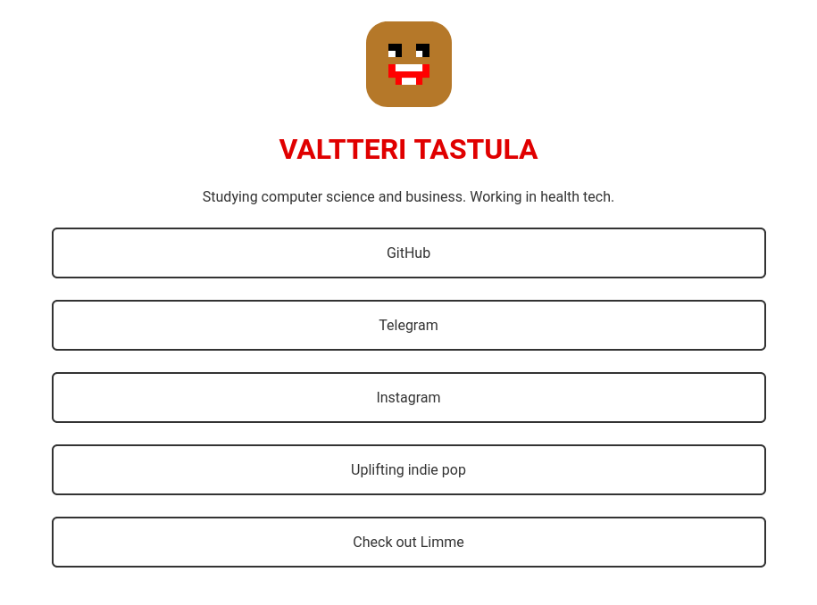

# Limme

Limme (Linkkimme) is simple and personal landing page similar to Linktree. Use it to quickly showcase your projects and internet presence!

Built with [Svelte](https://svelte.dev). Live at [Surge](https://ula.surge.sh).



## Installing and running

```bash
npm install
npm run dev    # for development
npm run build  # for production
```

See [Svelte's component template](https://github.com/sveltejs/component-template) for detailed instructions.

## Credits

- Favicon made by [Freepik](https://www.freepik.com) from [Flaticon](https://www.flaticon.com).
